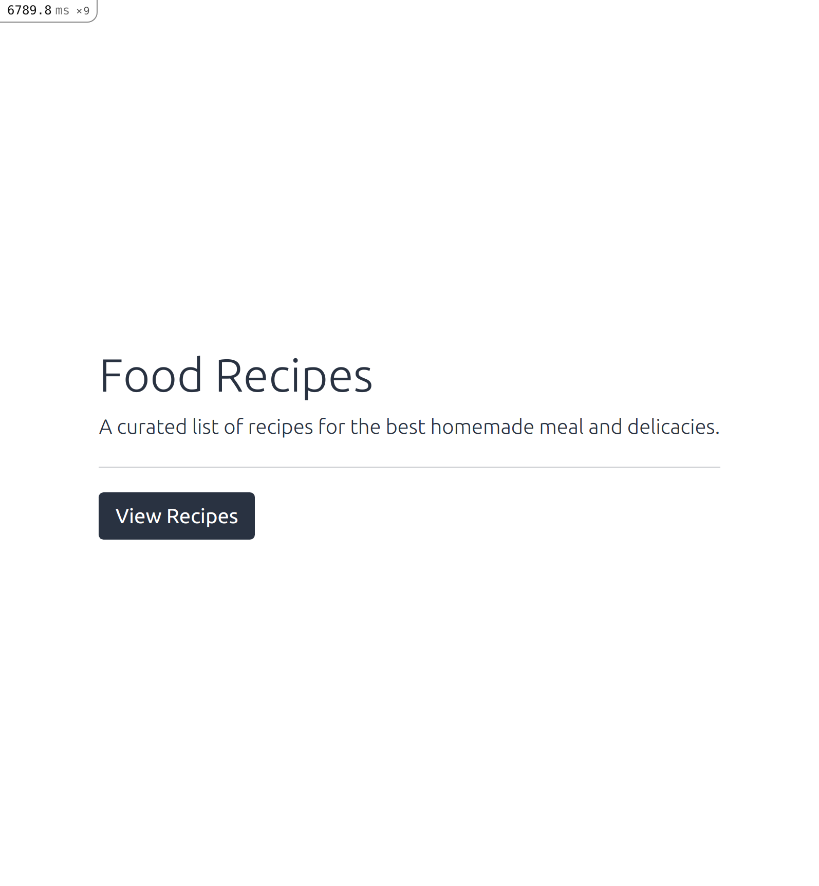
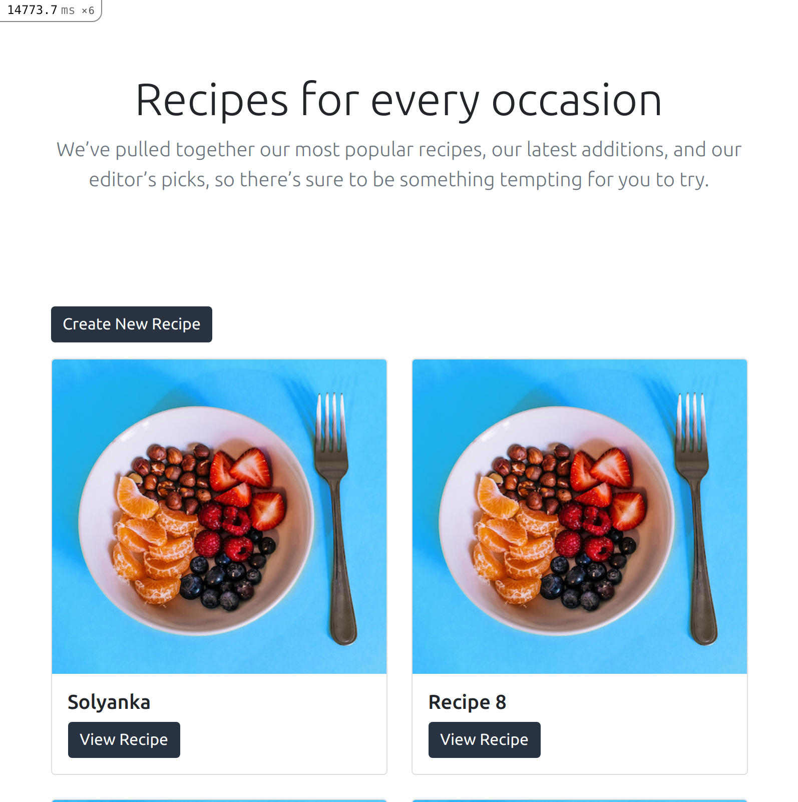
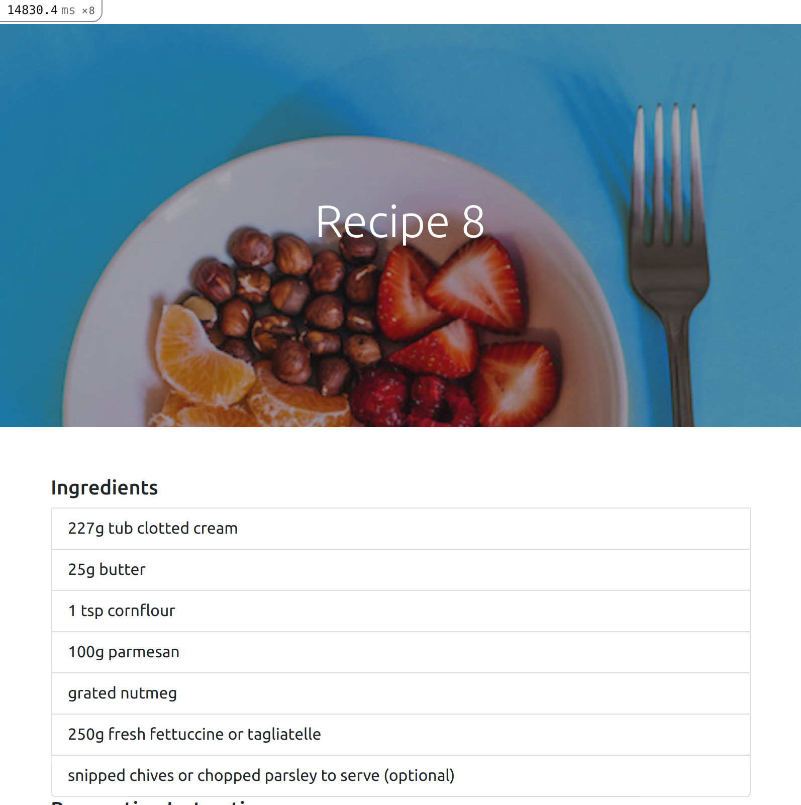
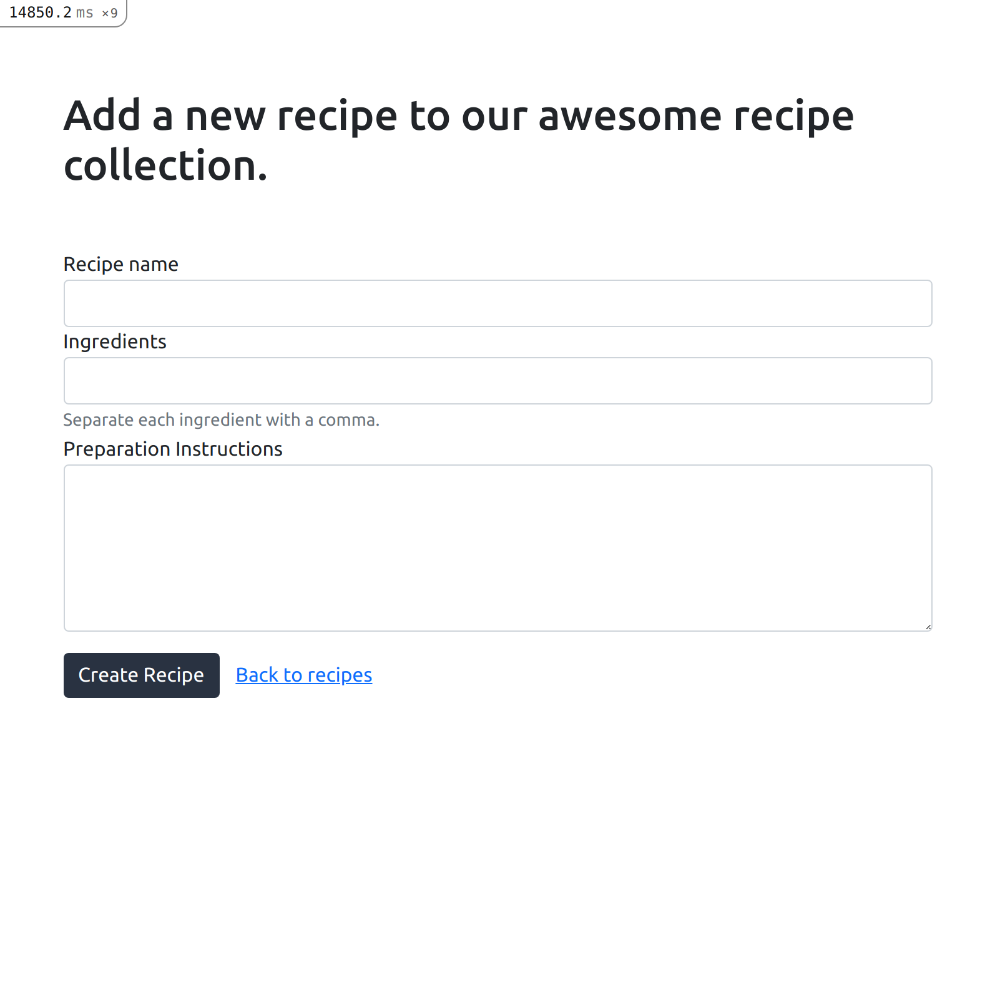

# README

This is a tutorial how to build a food recipe application with Ruby on Rails and a React frontend in the one repo, using PostgreSQL as your database and Bootstrap for styling
[Source](https://www.digitalocean.com/community/tutorials/how-to-set-up-a-ruby-on-rails-project-with-a-react-frontend)

This README would normally document whatever steps are necessary to get the
application up and running.

Things you may want to cover:

* Ruby version  - 2.7.2
* Rails - 6.1.3.2

* System dependencies

* Configuration

* Database creation

* Database initialization

* How to run the test suite

* Services (job queues, cache servers, search engines, etc.)

* Deployment instructions

* ...
